# Homelab Network Diagram

## Architecture Overview

```mermaid
graph TB
    subgraph "External Network (192.168.1.x)"
        USER["👤 User / Client"]
        NAS["📁 NAS<br/>192.168.1.2"]
    end

    subgraph "Docker Host (Synology NAS)"
        subgraph "horizon_network"
            subgraph "Infrastructure"
                ADGUARD["🔒 AdGuard Home<br/>port 8090"]
                NPM["🔄 Nginx Proxy Manager<br/>port 80/443/81"]
                HOMEPAGE["📊 Homepage Dashboard<br/>port 3005"]
            end

            subgraph "Monitoring"
                UPTIME["⏱️ Uptime Kuma<br/>port 3001"]
                MYSPEED["⚡ MySpeed<br/>port 5216"]
                DOZZLE["📜 Dozzle<br/>port 9999"]
                TUGTAINER["🐳 Tugtainer<br/>port 9412"]
            end

            subgraph "Multimedia"
                IMMICH["📷 Immich<br/>port 2283"]
                JELLYFIN["📺 Jellyfin<br/>port 8096"]
            end

            subgraph "Home Automation"
                HA["🏠 Home Assistant<br/>port 8123"]
                MQTT["🔗 Mosquitto MQTT<br/>port 1883"]
            end

            subgraph "Database"
                POSTGRES["💾 PostgreSQL<br/>port 5432"]
            end

            subgraph "Tools"
                INVOICESHELF["💵 InvoiceShelf<br/>port 8090"]
                MAILPIT["📧 Mailpit<br/>port 8025"]
                DOKPLOY["🚀 Dokploy<br/>port 3002"]
            end

            subgraph "Web Apps"
                WENDY["💒 Wendy Backend<br/>port 5454"]
                WENDYFE["💒 Wendy Frontend<br/>port 3454"]
            end

            subgraph "Template Server"
                NGINX["📦 Portainer Templates<br/>nginx port 8099"]
            end
        end

        subgraph "NAS Volumes"
            VOL_CONFIG["📂 /Volume1/public/config/<br/>adguard, nginxpm, homepage<br/>immich, jellyfin, mosquitto"]
            VOL_MEDIA["📂 /Volume1/media/<br/>photos, videos<br/>tv series, movies"]
        end
    end

    subgraph "External Services"
        PORTAINER["🖥️ Portainer Cloud<br/>Container Management"]
        WATCHTOWER["👁️ Watchtower<br/>Image Auto-Update"]
    end

    %% Connections - External
    USER -->|DNS 53| ADGUARD
    USER -->|HTTP/HTTPS| NPM
    USER -->|Browser| HOMEPAGE
    USER -->|Browser| PORTAINER

    %% Connections - Infrastructure
    HOMEPAGE -->|widgets| UPTIME
    HOMEPAGE -->|widgets| MYSPEED
    HOMEPAGE -->|widgets| DOZZLE
    HOMEPAGE -->|widgets| TUGTAINER
    HOMEPAGE -->|widgets| ADGUARD
    HOMEPAGE -->|widgets| NPM
    HOMEPAGE -->|widgets| IMMICH

    %% Connections - Monitoring
    TUGTAINER -->|monitors| DOCKER["🐳 Docker Daemon"]
    DOZZLE -->|logs| DOCKER
    UPTIME -->|checks| HOMEPAGE
    UPTIME -->|checks| HA
    MYSPEED -->|tests| USER

    %% Connections - Data
    IMMICH --> POSTGRES
    HA --> POSTGRES
    WENDY --> POSTGRES
    INVOICESHELF --> POSTGRES

    %% Connections - MQTT
    HA <-->|MQTT| MQTT

    %% Connections - Volumes
    HOMEPAGE -.->|config| VOL_CONFIG
    ADGUARD -.->|config| VOL_CONFIG
    NPM -.->|config| VOL_CONFIG
    IMMICH -.->|config| VOL_CONFIG
    JELLYFIN -.->|config| VOL_CONFIG
    MOSQUITTO -.->|config| VOL_CONFIG

    IMMICH -.->|photos| VOL_MEDIA
    JELLYFIN -.->|media| VOL_MEDIA

    %% Connections - Templates
    NGINX -->|serves| PORTAINER

    %% Connections - Auto Updates
    WATCHTOWER -->|monitors| DOCKER

    %% Frontend to Backend
    WENDYFE -->|API| WENDY
    INVOICESHELF -->|SMTP| MAILPIT

    %% Styling
    classDef infrastructure fill:#4A90E2,stroke:#2E5C8A,color:#fff
    classDef monitoring fill:#7ED321,stroke:#5BA817,color:#fff
    classDef multimedia fill:#F5A623,stroke:#C27F1A,color:#fff
    classDef automation fill:#9013FE,stroke:#5D0A99,color:#fff
    classDef database fill:#FF6B6B,stroke:#C92A2A,color:#fff
    classDef tools fill:#50E3C2,stroke:#2B9B8E,color:#fff
    classDef webapp fill:#B8E986,stroke:#82B348,color:#fff
    classDef external fill:#CCCCCC,stroke:#999999,color:#000
    classDef storage fill:#FFA500,stroke:#CC8400,color:#fff

    class ADGUARD,NPM,HOMEPAGE infrastructure
    class UPTIME,MYSPEED,DOZZLE,TUGTAINER monitoring
    class IMMICH,JELLYFIN multimedia
    class HA,MQTT automation
    class POSTGRES database
    class INVOICESHELF,MAILPIT,DOKPLOY tools
    class WENDY,WENDYFE webapp
    class USER,NAS,PORTAINER,WATCHTOWER external
    class VOL_CONFIG,VOL_MEDIA storage
```



## Network Flows

### 1. **DNS Traffic Flow**

```
User Device → 192.168.1.2:53 (AdGuard Home)
                    ↓
         Filtered DNS response (ads blocked)
                    ↓
              User Device
```

### 2. **Reverse Proxy Flow**

```
External Request → 192.168.1.2:80/443 (Nginx Proxy Manager)
                            ↓
              Routes to appropriate service
         (AdGuard, Homepage, Immich, etc.)
                            ↓
                    Service response
```

### 3. **Dashboard Widget Flow**

```
Browser → Homepage:3005
            ↓
      Fetches widget data from:
      ├─ Uptime Kuma (uptime status)
      ├─ MySpeed (speed test results)
      ├─ Dozzle (container logs)
      ├─ Tugtainer (image updates)
      ├─ AdGuard (DNS stats)
      └─ Portainer (container status)
            ↓
      Renders unified dashboard
```

### 4. **Database Access Pattern**

```
Services (Immich, Home Assistant, Wendy)
            ↓
      PostgreSQL:5432
            ↓
      Named volume: postgres_data
```

### 5. **File Access Pattern**

```
NAS Volumes
├─ /Volume1/public/config/    ← Configuration files
│   ├─ homepage/              ← Dashboard config
│   ├─ adguard/               ← DNS rules
│   ├─ nginxpm/               ← Proxy rules
│   ├─ mosquitto/             ← MQTT config
│   └─ ...
└─ /Volume1/media/            ← Media files
    ├─ photos/                ← Immich photos
    ├─ videos/                ← Video library
    ├─ tv series/             ← TV shows
    └─ movies/                ← Movies
```

## Service Dependencies

### Startup Order (Recommended)

1. **Database Layer** - PostgreSQL (prerequisite)
2. **Networking Layer** - horizon_network, AdGuard
3. **Proxy Layer** - Nginx Proxy Manager
4. **Core Services** - Immich, Home Assistant
5. **Monitoring Layer** - Uptime Kuma, Dozzle, Tugtainer
6. **Dashboard** - Homepage (depends on all above)

### Port Assignments

| Service             | Port  | Type    | Purpose              |
| ------------------- | ----- | ------- | -------------------- |
| AdGuard             | 53    | UDP/TCP | DNS queries          |
| AdGuard             | 8090  | TCP     | Admin panel          |
| Nginx PM            | 80    | TCP     | HTTP traffic         |
| Nginx PM            | 443   | TCP     | HTTPS traffic        |
| Nginx PM            | 81    | TCP     | Admin panel          |
| Homepage            | 3005  | TCP     | Dashboard            |
| Uptime Kuma         | 3001  | TCP     | Uptime monitoring    |
| Home Assistant      | 8123  | TCP     | Smart home           |
| Mosquitto           | 1883  | TCP     | MQTT broker          |
| Immich              | 2283  | TCP     | Photo library        |
| Jellyfin            | 8096  | TCP     | Media server         |
| Dozzle              | 9999  | TCP     | Log viewer           |
| Tugtainer           | 9412  | TCP     | Image monitor        |
| PostgreSQL          | 5432  | TCP     | Database             |
| MySpeed             | 5216  | TCP     | Speed test           |
| Wendy               | 5454  | TCP     | Wedding app backend  |
| Wendy Frontend      | 3454  | TCP     | Wedding app frontend |
| InvoiceShelf        | 8090  | TCP     | Invoicing            |
| Mailpit             | 8025  | TCP     | Mail testing         |
| Dokploy             | 3002  | TCP     | Deployment           |
| Portainer Templates | 8099  | TCP     | App templates        |

## Network Configuration

### horizon_network Details

- **Type**: Bridge network (internal Docker network)
- **Driver**: bridge
- **Scope**: Local (NAS host only)
- **DNS**: Docker embedded DNS (127.0.0.11:53)
- **All services can reach each other by container name**

Example: `http://tugtainer:9412` (instead of IP)

## Security Architecture

```
┌─────────────────────────────────────────┐
│         External Network (Internet)     │
└──────────────────┬──────────────────────┘
                   │
                   ↓ (Port 80/443 only)
         ┌─────────────────────┐
         │ Nginx Proxy Manager │ (Reverse Proxy)
         └──────────┬──────────┘
                    │
    ┌───────────────┼───────────────┐
    │               │               │
    ↓               ↓               ↓
┌────────┐   ┌─────────┐   ┌───────────┐
│AdGuard │   │Homepage │   │Other Apps │
└────────┘   └─────────┘   └───────────┘
    │               │               │
    └───────────────┼───────────────┘
                    │
         ┌──────────────────────┐
         │  horizon_network     │
         │  (Docker Internal)   │
         └──────────────────────┘
                    │
         ┌──────────────────────┐
         │   NAS Volume Mounts  │
         │  /Volume1/...        │
         └──────────────────────┘
```

### Security Layers

1. **Firewall** - NAS firewall blocks direct access to services
2. **Reverse Proxy** - Nginx PM validates and routes traffic
3. **DNS Filtering** - AdGuard blocks malicious domains
4. **Internal Network** - horizon_network isolates Docker traffic
5. **Volume Permissions** - NAS filesystem permissions control file access

## Scaling Considerations

### Current Capacity

- Single NAS host
- Docker Compose (single engine)
- Shared PostgreSQL instance
- Centralized volume storage

### Future Expansion

- Multi-host Docker Swarm or Kubernetes
- Distributed PostgreSQL (primary/replica)
- Separate storage volumes for high-I/O services (Immich)
- Load balancing across multiple instances
